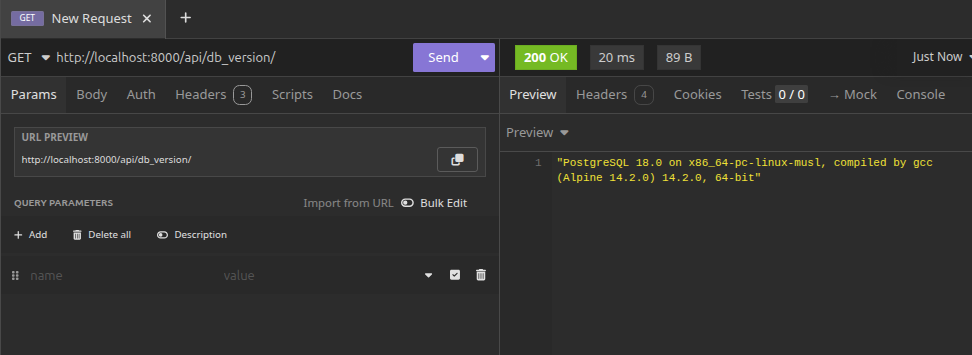
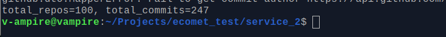
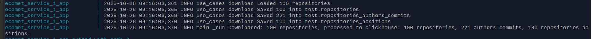
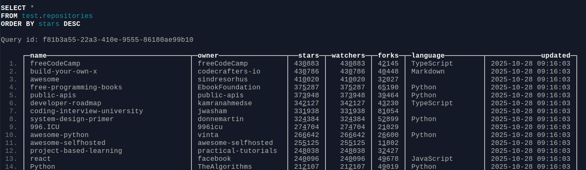
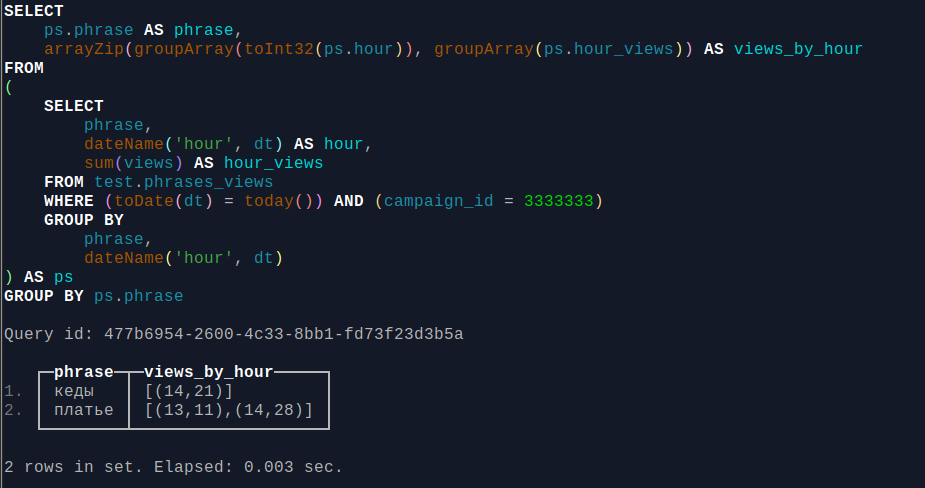

## Service 1

### Запустить сервис из директории service_1:
- Задать переменные окружения в `.env`
```
PROJECT_DIR=
POSTGRES_USER=
POSTGRES_PASSWORD=
POSTGRES_DATABASE=
```

- Выполнить `make build ; make up`

### Примечание
Т.к. сервис содержит только один ендпоинт с версией и по заданию нужно только доработать зависимость 
я не стал выносить инииализацию app и обработчики в отдельные модули, хотя при добавлении эндпоинтов по своему опыту
считаю целесобразным отсавить в main только вызов фабричной функции и настройку экземпляра приложения.

Использовал докер чтобы не разворачивать базу данных.

### Результат:




## Service 2

### Запустить сервис из директории service_2:
- Задать переменные окружения в `.env`
```
GITHUB_ACCESS_TOKEN=
```

- Выполнить `make build ; make up`

### Примечание
Повзолил себе отрефакторить ваш GithubReposScrapper, т.к. на мой вкус он в своей начальной версии нарушает 
"принцип единой ответственности" - помимо парсинга берет на себя инициализацию и управление жизненым циклом http сессии.
Также такой способ соотвествует принципу IoC (inversion of control) 
в контексте луковой архитектуры - внешний слой управляет зависимостями сервсиного слоя.
Кроме того, по моему опыту сессию лучше вообще делать синглтоном по всему приложению, т.к. она внутри может создавать
пул соединений и в этом случае мы можем переиспользовать соединения по всему приложению не только для одного класса скраппера.

Также заголовки авторизации мне кажется лучше передавать для каждого запроса отдельно, 
это будет удобнее если понадобится использовать ротацию токенов.

По лимитам взял лимит для авторизованных токенов 5000/3600 ~1.38 запроса в сек, 
у меня в среднем один запрос занимал 0.5-0.8 сек поэтому с учетом того что мы делаем запрос к одному хосту выставил 
MCR_LIMIT=5.

По архитектуре т.к. здесь всего один класс скраппера не стал слишком усложнять и делайть слишком много модулей, 
пытался сделать оптимально в плане баланса между разделением на слои и относительной простотой.

Использовал доп. библиотеки:
- pydantic-settings - для управлением настройками
- tenacity для ретраев
- aiolimiter - для управления рейт-лимитами

### Результат:




## Service 3

### Запустить сервис из директории service_3:
- Задать переменные окружения в `.env`
```
PROJECT_DIR=
GITHUB_ACCESS_TOKEN=
CLICKHOUSE_HOST=
CLICKHOUSE_PORT=
CLICKHOUSE_USER=
CLICKHOUSE_PASSWORD=
CLICKHOUSE_DB=test
CLICKHOUSE_DEFAULT_ACCESS_MANAGEMENT=
LOG_LEVEL=
```

- Выполнить `make build ; make up`
- Для входа в кликхаус `make ch`


### Примечание
В этом сервисе уже более сложное дерево зависимостей, поэтому тут уже сделал по классической луковой архитектуре 
с использованием DI контейнера для управления зависимостями. 

Для DI контейнера использовал свою собственную легковесную реализацию из своей же библиотеки [handybits](https://github.com/V-ampire/handybits)
в которой храню полезные утилиты и функции накопленные опытом. 
В целом можно также использовать фреймворки типа `rodi` или `dishka`, но у меня к ним периодически есть вопросы :)
`data_layer` - пердставляет собой паттерн `репозиторий` - переименовал чтобы не путаться с github репоиториями.

По функционалу DLQ - здесь примерная реализация с охранением данных в json-файл 
с возможностью последующей повторной попытки сохранения, но в реальном приложении конечно будет более конкретная 
политика обработки таких ошибок (с очередями или другими хранилищами) вплоть до необходимости вообще 
делать повторные попытки с помощью такого функционала, возможно достаточно просто докачать их на следующем запуске.

Насчет оптимизации при сохранении батчами - проверил документацию кликхауса:
`We recommend inserting data in batches of at least 1,000 rows, and ideally between 10,000–100,000 rows. 
Fewer, larger inserts reduce the number of parts written, minimize merge load, and lower overall system resource usage.`
Учитывая что скраппер скачивает 100 репозиториев, в которых коммитов ококо 200 - в данном случае врятли это даст эффект, 
тем не менее добавил в `ClickhouseDataLayer.insert` деление на батчи и сохрание по умолчанию на 1000 строк.

Использовал доп. библиотеки:
- pydantic-settings - для управлением настройками
- tenacity для ретраев
- aiolimiter - для управления рейт-лимитами
- click - для более удобного интерфейса main.py
- [handybits](https://github.com/V-ampire/handybits) как отметил выше в основном для DI контейнера и нескольких утилит.


### Результат:







### Примечание
В прилагаемом sql файле устаревшая дата, т.к. по заданию предполагаются запросы за сегодня несколько обновил данные 
+ добавл другие фразы и айди компании.

Запрос:
```
select ps.phrase as phrase
  , arrayZip(
      groupArray(toInt32(ps.hour))
      , groupArray(ps.hour_views)
    ) as views_by_hour
from (
  select phrase
    , (dateName('hour', dt)) as hour
    , sum(views) as hour_views
  from test.phrases_views
  where toDate(dt) = today()
  and campaign_id =  3333333
  group by phrase, dateName('hour', dt)
) as ps
group by ps.phrase
;
```

### Результат:

